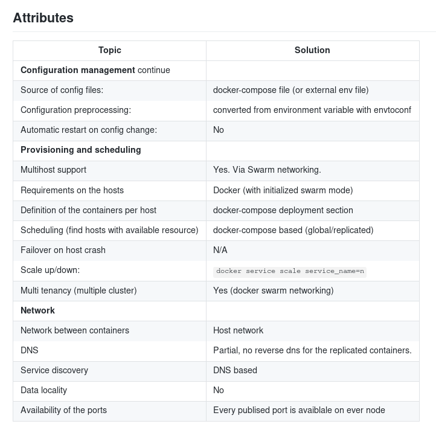
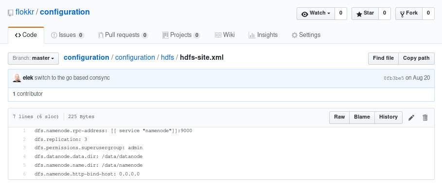

## 4 ways to dockerize Apache bigdata projects

Marton Elek, Hortonworks

---

### What is Apache Hadoop

 * _"The Apache Hadoop software library is a framework that allows for the distributed processing of large data sets across clusters of computers using simple programming models"_
 * Typical Good old Java application <!-- .element: class="fragment"  -->

---

### Hadoop in 120 secs

---


---


---

### Creating containers

```
FROM apline/jdk
ADD url
RUN wget `cat url` -O hadoop.tar.gz && tar zxf hadoop.tar.gz && rm hadoop.tar.gz && mv hadoop* hadoop && rm -rf /opt/hadoop/share/doc
CMD ["/opt/hadoop/bin/hdfs namenode"]
```

---

 * Configuration management  <!-- .element: class="fragment"  -->
 * Service discovery <!-- .element: class="fragment"  -->
 * Provisioning and scheduling <!-- .element: class="fragment"  -->
 * Multi-tenancy <!-- .element: class="fragment"  -->
 * Multi-node networking <!-- .element: class="fragment"  -->
 * Logging, monitoring <!-- .element: class="fragment"  -->

---

### Goal of this presentation

 * Show code examples with different technique
 * Demonstrate how these topics could be handled

---


---



---

### +1 way (Don't do this)

 * Use all the products in one big containers
 * Not practical for real clusters

---

## Docker compose

~~~

 * Declarative way to define docker run parameters
 * Easyest way to startup local clusters
 * Ideal for development

~~~

```
version: "3"
services:
   namenode:
      image: elek/hadoop-runner:latest
      hostname: namenode
      volumes:
         - ../../../hadoop-dist/target/hadoop-${VERSION}:/opt/hadoop
      ports:
         - 50070:50070
         - 9870:9870
      environment:
          ENSURE_NAMENODE_DIR: /data/namenode
      env_file:
         - ./docker-config
      command: ["/opt/hadoop/bin/hdfs","namenode"]
   datanode:
      image: elek/hadoop-runner:latest
      volumes:
        - ../../../hadoop-dist/target/hadoop-${VERSION}:/opt/hadoop
      ports:
        - 9864
      command: ["/opt/hadoop/bin/hdfs","datanode"]
   ksm:
      image: elek/hadoop-runner:latest
      volumes:
         - ../../../hadoop-dist/target/hadoop-${VERSION}:/opt/hadoop
      ports:
         - 9874:9874
      env_file:
          - ./docker-config
      command: ["/opt/hadoop/bin/hdfs","ksm"]
```

~~~

```
CORE-SITE.XML_fs.defaultFS=hdfs://namenode:9000
OZONE-SITE.XML_ozone.ksm.address=ksm
OZONE-SITE.XML_ozone.scm.names=scm
OZONE-SITE.XML_ozone.enabled=True
OZONE-SITE.XML_ozone.scm.datanode.id=/data/datanode.id
OZONE-SITE.XML_ozone.scm.block.client.address=scm
OZONE-SITE.XML_ozone.metadata.dirs=/data/metadata
OZONE-SITE.XML_ozone.handler.type=distributed
OZONE-SITE.XML_ozone.scm.client.address=scm
HDFS-SITE.XML_dfs.namenode.rpc-address=namenode:9000
HDFS-SITE.XML_dfs.namenode.name.dir=/data/namenode
LOG4J.PROPERTIES_log4j.rootLogger=INFO, stdout
LOG4J.PROPERTIES_log4j.appender.stdout=org.apache.log4j.ConsoleAppender
LOG4J.PROPERTIES_log4j.appender.stdout.layout=org.apache.log4j.PatternLayout
LOG4J.PROPERTIES_log4j.appender.stdout.layout.ConversionPattern=%d{yyyy-MM-dd HH:mm:ss} %-5p %c{1}:%L - %m%n
```

~~~

```
 docker-compose up
```

~~~

 Configuration management is not just storing the configuration.

 * Preprocess
 * Share common fragments
 * Support profiles

~~~

### [envtoconf](https://github.com/elek/envtoconf)

 * Convert environment variables to configuration files
 * Based on naming conventions

 ```
 HDFS-SITE.XML_dfs.namenode.rpc-address=namenode:9000
 HDFS-SITE.XML_dfs.namenode.name.dir=/data/namenode
 ```

```xml
<properties>
  <property><name>dfs.namenode.rpc-address</name><value>namenode:9000</value></property>
  <property><name>dfs.namenode.name.dir</name><value>/data/namenode</value></property>
</properties>
```

~~~

### Dark side

 * Limited to one node

~~~

More details and code:

https://github.com/flokkr/runtime-compose

---

## Docker swarm

~~~

 * Cluster management integrated with Docker Engine
 * Scaling
 * Multi-host networking
 * docker-compose
 * Load balancing

~~~

### Install

 * Master: ```docker swarm init```
 * Nodes: ```docker join --token asdqwd 10.143.0.2:2377```

~~~

```
version: "3"
services:
   namenode:
      image: flokkr/hadoop-hdfs-namenode:ozone
      hostname: namenode
      ports:
         - 9870
      env_file:
        - ./compose-config
      environment:
          ENSURE_NAMENODE_DIR: "/tmp/hadoop-hdfs/dfs/name"
   datanode:
      image: flokkr/hadoop-hdfs-datanode:ozone
      env_file:
        - ./compose-config
   ksm:
      image: flokkr/hadoop-hdfs-namenode:ozone
      hostname: ksm
      ports:
         - 9874
      env_file:
          - ./compose-config
      command: ["/opt/hadoop/bin/hdfs","ksm"]
   scm:
      hostname: scm
      image: flokkr/hadoop-hdfs-namenode:ozone
      ports:
         - 9876
      env_file:
          - ./compose-config
      command: ["/opt/hadoop/bin/hdfs","scm"]
```

~~~

```
CORE-SITE.XML_fs.default.name=hdfs://namenode:9000
CORE-SITE.XML_fs.defaultFS=hdfs://namenode:9000
HDFS-SITE.XML_dfs.namenode.rpc-address=namenode:9000
HDFS-SITE.XML_dfs.replication=1
HDFS-SITE.XML_dfs.namenode.datanode.registration.ip-hostname-check=false
OZONE-SITE.XML_ozone.ksm.address=ksm
OZONE-SITE.XML_ozone.scm.names=scm
OZONE-SITE.XML_ozone.enabled=True
OZONE-SITE.XML_ozone.scm.datanode.id=/data/datanode.id
OZONE-SITE.XML_ozone.scm.block.client.address=scm
OZONE-SITE.XML_ozone.metadata.dirs=/data/metadata
OZONE-SITE.XML_ozone.handler.type=distributed
OZONE-SITE.XML_ozone.scm.client.address=scm
LOG4J.PROPERTIES_log4j.rootLogger=INFO, stdout
LOG4J.PROPERTIES_log4j.appender.stdout=org.apache.log4j.ConsoleAppender
LOG4J.PROPERTIES_log4j.appender.stdout.layout=org.apache.log4j.PatternLayout
LOG4J.PROPERTIES_log4j.appender.stdout.layout.ConversionPattern=%d{yyyy-MM-dd HH:mm:ss} %-5p %c{1}:%L - %m%n
```

~~~

```
docker stack deploy -c docker-compose.yaml meetup
docker stack ls
docker service ls
docker service scale datanode=10
```

~~~

### Dark side

 * reverse dns limitations
 * configuration limitations
 * volume handling
 * data locallity

~~~

More details and code:

https://github.com/flokkr/runtime-swarm

---

## Hashicorp Nomad

~~~

 * Generic scheduler framework
 * Supports docker (and standalone apps)
 * Persistent storage support (ephemeral disks)

~~~

### DIY

 * Use docker as a packaging tool
 * use Nomad for scheduling
 * Use consul for service discovery
 * Use consul (+scripts) for configuration management

~~~

Install: run a nomad agent at each node

~~~

```
job "datanode" {
  datacenters = ["dc1"]

  type = "system"

  group "datanode" {
    count = 1

    task "datanode" {
      driver = "docker"
      config {
        image = "flokkr/hadoop-hdfs-datanode:ozone"
        network_mode = "host"
        force_pull = true
        volumes = [
          "local/data:/data"
        ]
        #{include "logging.nomad"}#
      }
      env {
        CONFIG_TYPE = "consul"
        CONSUL_KEY = "hdfs"
        HADOOP_LOG_DIR = "/tmp"
        PROMETHEUSJMX_ENABLED = "true"
      }
      resources {
        cpu = 1003
        memory = 2000
      }
    }
  }
}
```

~~~

Configuration management?

~~~

 Store configuration in a central place

```
conf.git [preprocess] --> consul --> [get] containers
```

~~~

### Consync

Upload and preprocessing




~~~


~~~

### [consul-launcher](https://github.com/elek/consul-launcher) Download and refresh

 * Download configuration
 * Listen on changes and restart the processing
 * (see also consul template)

~~~

Service discovery?

No more DNS based discovery.

Nomad supports consul by default.

Consul launcher should be extended to use discovery information.

~~~

```
job "ksm" {
  datacenters = ["dc1"]

  type = "service"

  group "ksm" {
    count = 1

    task "ksm" {
      driver = "docker"
      config {
        image = "flokkr/hadoop-hdfs-namenode:ozone"
        network_mode = "host"
         ...
      }
      service {
        name = "ksm"
        port = "web"
        tags = [
          "web"
        ]
      }
      env {
        CONFIG_TYPE = "consul"
        CONSUL_KEY = "hdfs"
      }
      resources {
        cpu = 1000
        memory = 2001
        network {
          port "web" {
            static = 9876
          }
          port "rpc" {
            static = 9000
          }
        }
      }
    }
  }
}
```

### Dark side

 * Confiuration syntax is limited (no preprocessing)
 * No Multi-tenancy

~~~

More details and code:

https://github.com/flokkr/runtime-nomad

---

## Thx

 * https://github.com/flokkr
 * https://github.com/elek
 * https://twitter.com/anzix

---

### Credits:

 * Yarn archirecture image is from [HadoopInternals](https://ercoppa.github.io/HadoopInternals/) by Emilio Coppa
 * HDFS architecture is from the Apache Hadoop documentation
